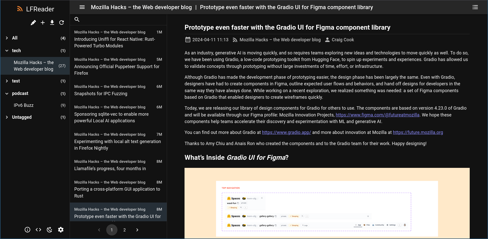

# LFReader

[](https://hub.docker.com/r/dcsunset/lfreader)
[](https://github.com/DCsunset/LFReader)


LFReader is a self-hosted **L**ocal-first **F**eed **Reader** written in Python and Preact/React.

## Features

- Local-first: Feeds and entries are stored in a sqlite3 database so that you can read local feeds even without Internet access. Futhermore, it supports archiving resources like images in the entries.
- Dark mode support: Users can choose between light and dark modes
- Flexible archiving options: User can use regex to filter the html tags and values when archiving

## Screenshots




## Installation

### Using docker/podman

```sh
docker run -d -p 8080:80 --name lfreader -v $PWD/data:/app/data dcsunset/lfreader
```

Then access `http://localhost:8080` in browser.

### Using pip

To install backend server only, you can use pip to install the backend dir in this repo:

```sh
pip install -e "git+https://github.com/DCsunset/LFReader.git#egg=lfreader_server&subdirectory=backend"
```

### Using Nix

This package is available in [NUR](https://nur.nix-community.org/repos/dcsunset/).
The output of the derivation includes both backend executable (`bin/lfreader-server`)
and frontend static files (in `share/lfreader`).

Besides, a NixOS module for backend server is provided in the [Nix flake](https://github.com/DCsunset/nur-packages) output.
Simply import the flake and import the module `modules.lfreader` and add the following NixOS configuration:

```nix
{
  imports = [ nur-dcsunset.modules.lfreader ];
  services.lfreader = {
    enable = true;
    # or use nur.repos.dcsunset.lfreader with NUR namespace
    package = nur-dcsunset.packages.lfreader;
    host = "::";
    port = 3000;
    logLevel = "debug";
  };
}
```


### From source code

First, clone this repo.

Then, build the frontend (bundled files are in directory `frontend/dist`):

```sh
cd frontend
npm i
npm run build
cd ..
```

Next, install dependencies and run backend:

```sh
# use Nix
nix run .#backend-prod

# or manually
cd backend
pip install -r requirements.txt
uvicorn lfreader_server.app:app --host 0.0.0.0 --port 3000
```

Finally, use your favorite web server to serve the frontend files (`frontend/dist`)
and set up the reverse proxy to pass routes prefixed by `/api` to backend.
If archiving is enabled (default), make sure the archives directory is served at `/archives`.

## Configuration

### Frontend

Available config options can be found in the sidebar UI.

One important option is to enable/disable archiving.
For feeds that contain many images or videos, it might be slow and expensive to archive them.
You can disable archiving globally in such case.

### Backend

The following environment variables are supported when running the backend:

| Variable        | Description      |
|-----------------|------------------|
| LFREADER_CONFIG | Config file path |


The config file is in JSON format.
Please see refer to `Config` class in file `backend/config.py` for available options and default values.


## Development

### Frontend

Change directory to `frontend`.
Create a symlink `public/archives`to the backend archive directory to serve resources.
Finally, run `npm run dev`.

### Backend

With Nix, run dev server directly: `nix run .#backend-dev`

Or install all the dependencies (you could also use `venv` here):

```sh
pip install -r fastapi uvicorn
uvicorn lfreader_server.app:app --reload --port 3000
```

To test if the backend pyproject can build successfully:

```sh
cd backend
## optionally set up vevn
# python -m venv venv
# . ./venv/bin/activate

## pip install
pip install .
```

## Migration

### v2.0.0

Move original environment variables to config file.

### v1.2.0

Steps to migrate database from below v1.2.0 to v1.2.0:
1. Make a backup of the old db first.
2. Create a new database by running LFReader server v1.2.0.
3. Add all previous feeds through API or Web UI
4. Run `python scripts/migrate_v1.2.0.py <old_db> <new_db>` to migrate all previous entries

## License

AGPL-3.0

